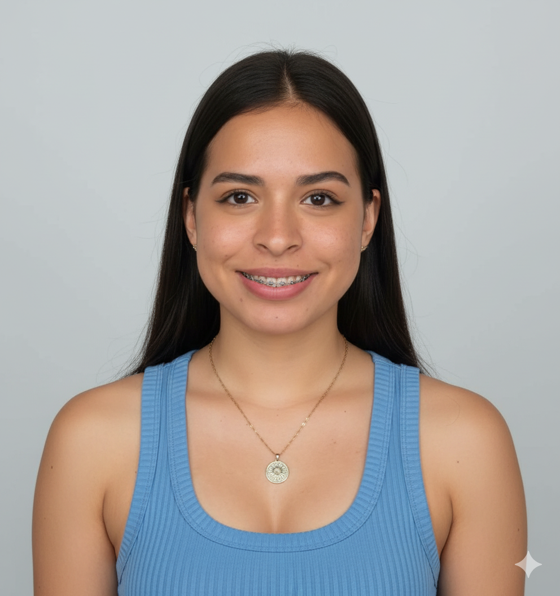

<h1 align="center"><b>Hi, I'm Angie</b> </h1>

  

 

## <b>About me</b>

<picture>
  
</picture>

- Computer Engineering student at the **Costa Rica Institute of Technology (TEC)**  
- Passionate about **software engineering**, **web platforms**, and **interactive systems (Unity/VR)**  
- Currently contributing to university/community projects  
- Seeking an **academic exchange** to strengthen research and project experience in an international setting

  <!-- CV + LinkedIn badges -->
  
  
  

 

  

##  <b>Skills</b>
 

- <b>Languages</b>: 
  
  
  
  

 

- <b>Front-End Development</b>: 
  
  
  
  

 

- <b>Software and Tools</b>: 
  
  
  
  

 

- <b>Extras</b>: 
  

  

## <b>Academic Activities & Certificates</b> 
<ul>
  <li>
    
     — 18th Congress on Computing for Development (Guatemala) — Participant.
  </li>
  <li>
    
     — “Web Services Fundamentals: Build Your Mini Social Network” (48 hours), Tecnológico de Costa Rica (TEC) & Myongji College.
  </li>
</ul>

 

## <b>Interests</b>
- Software engineering (Java/Python/Go)
- Web platforms (HTML/CSS/JS)
- Interactive systems & prototyping (Unity/VR)

 

## <b>Contact</b>
- Email: <a href="mailto:a.aguilar.5@estudiantec.cr">a.aguilar.5@estudiantec.cr</a>  
- LinkedIn: <a href="https://www.linkedin.com/in/angie-aguilar-398a14371/">linkedin.com/in/angie-aguilar-398a14371</a>
